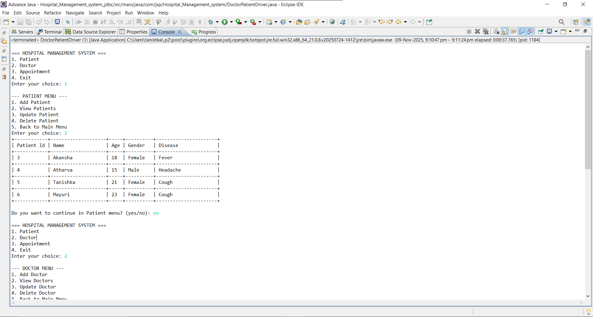

# Hospital Management System (JDBC Project)

## Project Overview
The **Hospital Management System** is a Java console-based application that helps hospitals manage patients, doctors, and appointments efficiently.  
It uses **JDBC (Java Database Connectivity)** to perform CRUD operations on a **MySQL database**.

This project demonstrates real-world database handling in Java — perfect for learning JDBC and SQL integration.

---

##Features

### Doctor Management
- Add new doctors  
- View all doctors  
- Update doctor details  
- Delete doctor records  

### Patient Management
- Add new patients  
- View all patients  
- Update patient details  
- Delete patient records  

### Appointment Management
- Book an appointment (linking patient & doctor)  
- View all appointments (formatted table view)  
- Check doctor availability on a specific date  

---

##Technologies Used
- Language: Java
- Database: MySQL
- Connectivity: JDBC
- IDE: Eclipse

##Output

